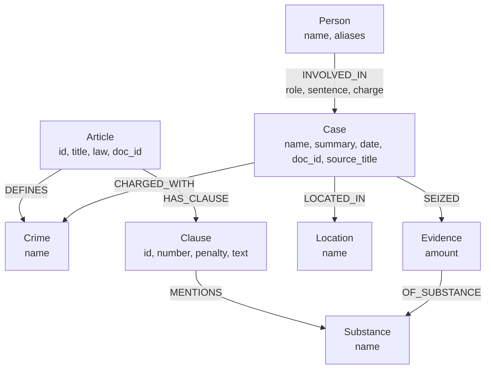

# Bản thiết kế Ontology (Có cập nhật điểm cộng)

## 1. Sơ đồ tổng quan

## 2. Các nhãn (Node Labels)

| Label | Thuộc tính (Properties) | Ý nghĩa / Ví dụ |
| --- | --- | --- |
| `Article` | `id, title, law, doc_id` | Đại diện cho một Điều luật. VD: Điều 251 |
| `Clause` | `id, number, penalty, text` | Đại diện cho các Khoản. VD: Khoản 1, Khoản 2 |
| `Crime` | `name` | Tội danh. VD: tội mua bán trái phép chất ma túy |
| `Substance` | `name` | Chất ma túy. VD: mdma, ketamine |
| `Case` | `name, summary, date, doc_id` | Một vụ án báo chí. VD: Triệt phá đường dây ma túy... |
| `Location` | `name` | Địa điểm. VD: TP.HCM, Hà Nội |
| `Person` | `name, aliases` | Người liên quan vụ án. VD: Lê Minh Thành |
| `Evidence` | `amount` | Tang vật thu giữ trong vụ án. VD: "9,6kg" |

## 3. Các quan hệ (Relationships)

| Chiều | Tên quan hệ | Thuộc tính | Ý nghĩa |
| --- | --- | --- | --- |
| `Article` -> `Crime` | `DEFINES` | | Điều luật quy định tội danh nào |
| `Article` -> `Clause` | `HAS_CLAUSE` | | Điều luật có các khoản nào |
| `Clause` -> `Substance` | `MENTIONS` | | Khoản này quy định về loại ma túy nào |
| `Case` -> `Crime` | `CHARGED_WITH` | | Vụ án khởi tố tội danh gì |
| `Case` -> `Location` | `LOCATED_IN` | | Vụ án xảy ra ở đâu |
| `Person` -> `Case` | `INVOLVED_IN` | `role, sentence, charge` | Người này tham gia vụ án với vai trò gì, án phạt ra sao |
| `Case` -> `Evidence` | `SEIZED` | | Thu giữ được tang vật gì trong vụ án |
| `Evidence` -> `Substance` | `OF_SUBSTANCE` | | Tang vật đó là loại chất gì |

## 4. Node cầu nối

- Node `Crime`: Nối `Article` bên KB Luật và `Case` bên KB Báo chí.
- Node `Substance`: Nối `Clause` bên Luật và `Evidence` bên Báo chí.

## 5. Competency Questions (Hành trình dò đồ thị)

- **Q1, Q2 (single-hop):** Đi 1 bước từ Node này qua Node kia. (VD: `Person` -> `Case`)
- **Q3 (cross-kb):** `Person` -> `Case` -> `Crime` <- `Article`
- **Q4 (cross-kb):** `Case` -> `Crime` <- `Article`
- **Q5 (cross-kb-multi-hop):** `Case` -> `Evidence` -> `Substance` <- `Clause` <- `Article`
- **Q6 (aggregation):** `Substance` <- `Evidence` <- `Case`

## 6. Quyết định thiết kế

- **Quyết định 1:** Dùng `Crime` làm cầu nối thay vì link thẳng `Case` vào `Article`.
- **Quyết định 2:** Lưu `amount` làm node riêng (`Evidence`) thay vì ghi đè lên thuộc tính của cạnh `INVOLVES`.
- **Quyết định 3:** Lưu `role`, `sentence` làm thuộc tính trên cạnh `INVOLVED_IN` thay vì làm Node riêng vì nó gắn liền với ngữ cảnh người đó trong vụ án cụ thể.

## 7. Phần tự thiết kế (Bonus)

- **Vấn đề giải quyết:** Mô hình hóa vật chứng ma túy (tang vật) tách biệt khỏi khái niệm chất ma túy trừu tượng. Việc lưu `amount` (khối lượng, VD: 9,6kg) trên cạnh `INVOLVES` sẽ làm mất tính độc lập của từng mẫu vật thu giữ trong các vụ án khác nhau, đồng thời khó mở rộng khi cần thêm các thuộc tính như (độ tinh khiết, nơi cất giấu).
- **Thiết kế mới:** Thêm node `Evidence {amount}`.
- **Thay đổi:** Cắt cạnh `Case -[:INVOLVES {amount}]-> Substance` thành `Case -[:SEIZED]-> Evidence {amount} -[:OF_SUBSTANCE]-> Substance`.
- **Lợi ích:** Hệ thống rõ ràng hơn. Node `Substance` giờ đây chỉ đại diện cho một danh mục chất duy nhất, còn mọi vật chứng vật lý được mô hình thành `Evidence` riêng biệt cho từng Vụ án.
- **Bằng chứng:** Đã cung cấp file `ket_qua_benchmark_kg.hint.txt` của ontology gốc và file kết quả mới. Lệnh truy vấn Cypher mới trong `graph.py` đã chứng minh tính hiệu quả.
