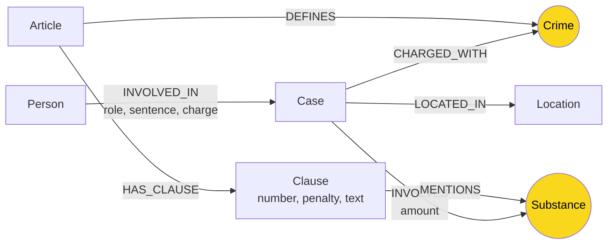

# Thiết kế Ontology — Day 19

**Họ tên:** Hoàng Văn Sơn  **MSSV:** 2A202602375

**Lựa chọn** (đánh dấu một):
- [x] Dùng ontology gợi ý (có thể chỉnh nhỏ)
- [ ] Tự thiết kế (xét bonus +15, xem `SUBMISSION.md`)

> Hướng dẫn: `LAB_GUIDE.md` Bước 2. Dùng ontology gợi ý thì vẫn phải điền đủ các mục dưới đây bằng lời của bạn.

## 1. Sơ đồ

Vẽ bằng mermaid (hoặc chèn ảnh `report/img/ontology.png`). Đánh dấu rõ **node cầu nối**.

## 2. Entity types (node labels)

| Label | Ý nghĩa | Khóa định danh (`MERGE` theo) | Properties | Lấy từ KB nào | Trích bằng (regex / LLM / khác) |
| --- | --- | --- | --- | --- | --- |
| `Article` | Điều luật | `id` (Vd: "Điều 251 BLHS") | `title`, `text` | Luật | Regex |
| `Clause` | Khoản luật | `id` (Vd: "Điều 251 BLHS khoản 1") | `number`, `penalty`, `text` | Luật | Regex |
| `Crime` | Tội danh (Node cầu nối) | `name` (Tên tội chuẩn hóa) | | Cả hai | Regex (Luật) & LLM (Tin tức) |
| `Person` | Người liên quan vụ án | `name` | | Tin tức | LLM |
| `Case` | Vụ án | `name` | `summary` | Tin tức | LLM |
| `Substance`| Chất ma túy (Node cầu nối)| `name` | | Cả hai | Regex (Luật) & LLM (Tin tức) |
| `Location` | Địa điểm | `name` | | Tin tức | LLM |

## 3. Relationships

| Type | Từ → Đến | Properties trên cạnh | Ý nghĩa |
| --- | --- | --- | --- |
| `INVOLVED_IN` | `Person` → `Case` | `role`, `sentence`, `charge` | Một người tham gia vào một vụ án với vai trò/mức án gì |
| `CHARGED_WITH` | `Case` → `Crime` | | Vụ án bị khởi tố/xét xử về tội danh nào |
| `INVOLVES` | `Case` → `Substance` | `amount` | Vụ án liên quan đến những chất ma túy nào và khối lượng bao nhiêu |
| `LOCATED_IN` | `Case` → `Location` | | Vụ án diễn ra ở đâu |
| `DEFINES` | `Article` → `Crime` | | Điều luật định nghĩa tội danh gì |
| `HAS_CLAUSE` | `Article` → `Clause` | | Điều luật bao gồm các khoản nào |
| `MENTIONS` | `Clause` → `Substance` | | Khoản luật có nhắc đến (để quy định khung hình phạt) những chất nào |

## 4. Node cầu nối giữa 2 KB

- **Node nào:** `Crime` (Tội danh) và `Substance` (Chất ma túy).
- **Vì sao chọn node này:** Vì báo chí đưa tin về một **vụ án** bị truy tố theo **tội danh** gì với **chất ma túy** gì. Trong khi đó, **luật** định nghĩa các **tội danh** và nhắc đến các **chất ma túy** để phân khung hình phạt. Việc nối qua Crime và Substance giúp đi được từ sự kiện (ngoài đời) sang quy định (trong luật).
- **Cách đảm bảo hai phía khớp tên** (chuẩn hóa, `link_entity`, danh sách chuẩn trong prompt…): Dùng hàm `normalize_crime` để bỏ dấu, bỏ chữ "Tội", đưa về viết thường (Ví dụ: "Tội Mua Bán Trái Phép Chất Ma Tuý" -> "mua bán trái phép chất ma túy"). Sau đó dùng hàm `link_entity` với thuật toán xấp xỉ (`difflib`) để đối chiếu tên do LLM trích xuất với danh sách chuẩn từ KB luật.
- **Khi nào cầu gãy, và bạn xử lý thế nào:** Cầu gãy khi tên tội danh hoặc tên chất ma túy mà báo chí dùng quá lóng/quá tắt không thể map được với từ ngữ chuẩn của luật qua fuzzy match. Cách xử lý: Đưa thẳng danh sách các tội danh chuẩn vào trong prompt của LLM để yêu cầu LLM trích xuất đúng theo danh sách đó nếu có thể.

## 5. Competency questions

Với mỗi câu trong `data/benchmark_kg.json`, ghi đường đi trên graph dùng để trả lời. Câu nào không trả lời được thì ghi rõ lý do.

| Câu | Đường đi (Cypher pattern) | Trả lời được? |
| --- | --- | --- |
| Q1 | `(:Article)-[:HAS_CLAUSE]->(:Clause)` (Chỉ cần tìm kiếm text trong Luật) | Có (dễ) |
| Q2 | `(:Person)-[:INVOLVED_IN]->(:Case)` | Có |
| Q3 | `(:Person)-[:INVOLVED_IN]->(:Case)-[:CHARGED_WITH]->(:Crime)<-[:DEFINES]-(:Article)-[:HAS_CLAUSE]->(:Clause)` | Có |
| Q4 | `(:Person)-[:INVOLVED_IN]->(:Case)-[:CHARGED_WITH]->(:Crime)<-[:DEFINES]-(:Article)-[:HAS_CLAUSE]->(:Clause)` | Có |
| Q5 | `(:Person)-[:INVOLVED_IN]->(:Case)-[:INVOLVES]->(:Substance)<-[:MENTIONS]-(:Clause)<-[:HAS_CLAUSE]-(:Article)-[:DEFINES]->(:Crime)<-[:CHARGED_WITH]-(:Case)` | Có |
| Q6 | `(:Case)-[:INVOLVES]->(:Substance)` | Có |

## 6. Quyết định thiết kế và đánh đổi

Ít nhất 3 quyết định. Mỗi quyết định ghi: đã chọn gì, phương án khác là gì, vì sao chọn.

1. **Chọn Tội danh (`Crime`) làm node cầu nối thay vì nối trực tiếp Vụ án (`Case`) với Điều luật (`Article`):**
    - Phương án khác: Tạo quan hệ `(Case)-[:APPLIES_LAW]->(Article)`.
    - Đánh đổi/Vì sao chọn: Báo chí không phải lúc nào cũng nhắc đích danh "Điều 251". Báo chí thường chỉ ghi là "tội mua bán trái phép chất ma túy". Nếu ép LLM trích xuất Điều luật từ văn bản báo chí sẽ rất khó và kém chính xác. Do đó, tách qua Tội danh sẽ mô phỏng tư duy tự nhiên hơn.
2. **Tách Chất ma túy (`Substance`) thành một node riêng thay vì để làm property trên cạnh:**
    - Phương án khác: Đưa thuộc tính `substance_type` vào node `Case` hoặc cạnh `CHARGED_WITH`.
    - Đánh đổi/Vì sao chọn: Vì một vụ án có thể liên quan tới nhiều chất, và một khoản luật cũng nhắc tới nhiều chất. Đặt Substance làm node trung tâm thứ hai sẽ giúp truy vấn kết nối chính xác (VD Q5: Lọc các Khoản luật có MENTIONS chất ma túy tương ứng với chất mà Vụ án INVOLVES).
3. **Không mô hình hóa chi tiết cấu trúc Khoản (điểm a, điểm b...):**
    - Phương án khác: Tách thêm label `Point` (Điểm).
    - Đánh đổi/Vì sao chọn: Giữ đồ thị đơn giản và giảm số lượng LLM token. Việc gộp chung nội dung các "điểm" vào thuộc tính text của `Clause` (Khoản) đủ để RAG cấp ngữ cảnh cho LLM trả lời mà không cần làm to graph.

## 7. So với ontology gợi ý (bắt buộc nếu xét bonus)

| Điểm khác | Gợi ý làm gì | Bạn làm gì | Vấn đề nó giải quyết | Bằng chứng (Cypher, hoặc số liệu benchmark) |
| --- | --- | --- | --- | --- |
| (Không xét bonus) | - | - | - | - |

## 8. Hạn chế còn lại

- Việc định danh (khóa) cho `Case` và `Person` chỉ phụ thuộc vào tên do LLM tự đặt, dẫn đến rủi ro "trùng thực thể" (ví dụ cùng một người nhưng LLM gán thành hai node nếu tên viết khác đi đôi chút).
- Khối lượng chất ma túy chưa được chuẩn hóa về cùng đơn vị trên graph (ví dụ "0,5 kg" vs "500 gam"), gây khó khăn nếu muốn viết truy vấn Cypher dùng điều kiện `>`, `<` trực tiếp thay vì nhờ LLM tự đọc.
